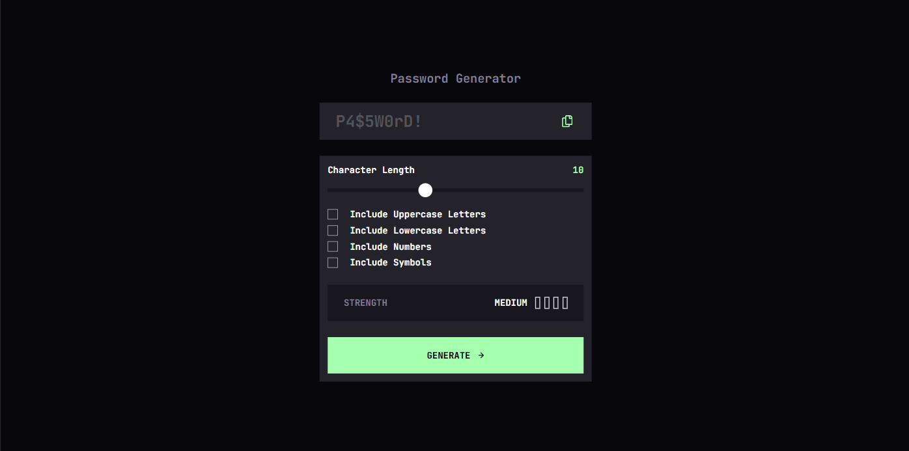

# Frontend Mentor - Password generator app solution

This is a solution to the [Password generator app challenge on Frontend Mentor](https://www.frontendmentor.io/challenges/password-generator-app-Mr8CLycqjh).

## Table of contents

- [Overview](#overview)
  - [The challenge](#the-challenge)
  - [Screenshot](#screenshot)
  - [Links](#links)
- [My process](#my-process)
  - [Built with](#built-with)
  - [What I learned](#what-i-learned)
  - [Continued development](#continued-development)
- [Author](#author)

## Overview

### The challenge

Users should be able to:

- Generate a password based on the selected inclusion options.
- Copy the generated password to the computer's clipboard.
- See a strength rating for their generated password.
- View the optimal layout for the interface depending on their device's screen size.
- See hover and focus states for all interactive elements.

### Screenshot



### Links

- Solution URL: [Github](https://github.com/enghalih/password-generator)
- Live Site URL: [Live Site](https://enghalih.github.io/password-generator)

## My process

### Built with

- Semantic HTML5 markup.
- CSS custom properties based on the style guide.
- Flexbox and CSS Grid.
- Mobile-first workflow.
- **Vanilla JavaScript** (Pure implementation without bundlers).
- **Nanoid** library for secure ID generation.
- **zxcvbn** library for realistic password strength estimation.

### What I learned

Working on this project helped me master **ES Modules** in a vanilla environment. Since I didn't use Vite, I had to manually link the correct browser-ready files from the `node_modules` folder.

I am particularly proud of the **Strength Meter** logic. I used a custom `data-level` attribute on a container, which allows CSS to automatically style the four bars (color and quantity) based on the score returned by the strength library.

```css
[data-level="1"] .level-1,
[data-level="2"] :is(.level-1, .level-2),
[data-level="3"] :is(.level-1, .level-2, .level-3),
[data-level="4"] :is(.level-1, .level-2, .level-3, .level-4) {
  background-color: var(--color-yellow-300);
  border: none;
}
```

I also implemented the **Clipboard API** to provide a seamless "copy" experience. This modern API is much more efficient than older methods for interacting with the user's clipboard.

```js
copyEl?.addEventListener("click", async (e) => {
  const textToCopy = passwordEl.innerHTML;

  if (!textToCopy || textToCopy === "") return;

  try {
    await navigator.clipboard.writeText(textToCopy);

    copyEl.classList.add("copied");

    setTimeout(() => {
      copyEl.classList.remove("copied");
    }, 3000);
  } catch (err) {
    debug("error to copy: ", err);
  }
});
```

### Challenges encountered

One major hurdle was dealing with an **Infinite Loop** during the password generation process. I realized that if the user didn't select any character options or if the length was invalid, the generation function would crash the browser. I overcame this by implementing strict validation checks before calling the library.

Another challenge was importing libraries like `zxcvbn` which use CommonJS. I learned how to include them as global scripts in the HTML while keeping my main logic as a module.

### Continued development

In the future, I plan to:

- Explore CSS subgrid for even more precise alignment of the UI components.
- Implement more advanced feedback for the copy button, like a "Copied!" tooltip.

## Author

- Frontend Mentor - [@enghalih](https://www.frontendmentor.io/profile/enghalih)
- Github - [@enghalih](https://github.com/enghalih)
- Linkedin - [Wenning Ghalih](https://www.linkedin.com/in/enghalih/)
